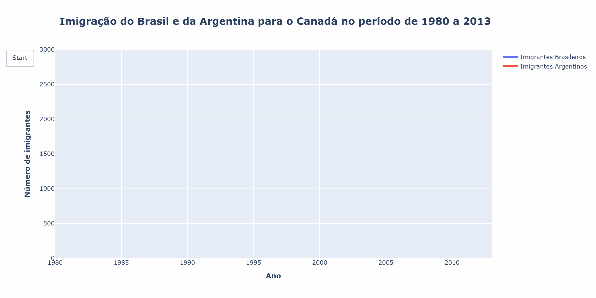
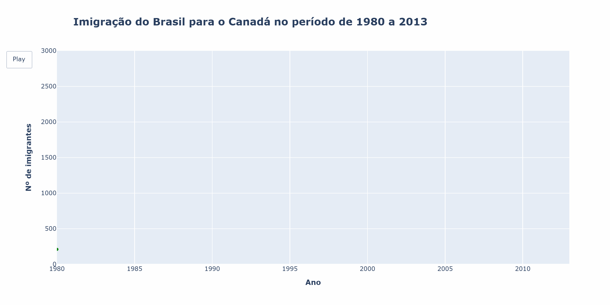

# 📊Visualisação de Dados 

Este repositório contém um notebook desenvolvido durante os estudos de Visualização de Dados, com foco na análise exploratória e na criação de gráficos informativos utilizando Python.
O objetivo é transformar dados brutos em visualizações claras, facilitando a interpretação e a tomada de decisões.

O dataset utilizado neste notebook representa dados de uma empresa de consultoria especializada em processos de imigração do Brasil para o Canadá.

# Bibliotecas 
- Pandas 
- Matplotlib 
- Seaborn
- Plotly

# Demonstração dos Gráficos 

# Gráficos interativos

-

# Imigração Brasil → Canadá

## Gráfico extra Resultados das Vendas de 4 Lojas em 2022

